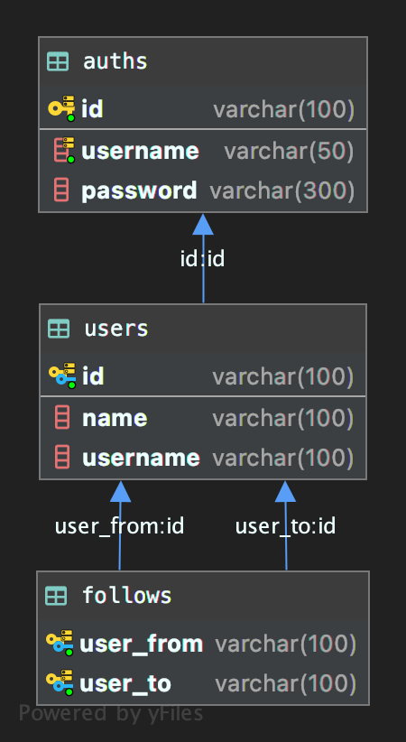

# Social network

This is a project of Platzi's course: https://platzi.com/clases/practico-node/

It is a node project that has a microservice architecture to simulate a social network. It is built with:

- Node 12
- MySQL

# Database model

#### Please find in docs/database.sql the script for create the database

####Also, you can find a docker-compose file to recreate the database locally in docs/docker-compose.yml

# Environment variables

## API

| Variable |  Type   |   Description   | Default |
| :------: | :-----: | :-------------: | ------- |
| API_PORT | Integer | Port of the API | 3000    |

## JWT

|    Variable     |  Type  |       Description        | Default |
| :-------------: | :----: | :----------------------: | ------- |
|   SECRET_KEY    | String | Secret key of JWT tokens | secret  |
| AUTH_TOKEN_TYPE | String | Token type to use in JWT | Bearer  |

## MySQL

|    Variable    |  Type  |    Description    | Default       |
| :------------: | :----: | :---------------: | ------------- |
|   MYSQL_HOST   | String | MySQL server host | localhost     |
|   MYSQL_USER   | String |    MySQL user     | nodeuser      |
| MYSQL_PASSWORD | String |  MySQL password   | nodeuser      |
| MYSQL_DATABASE | String |  MySQL database   | socialnetwork |